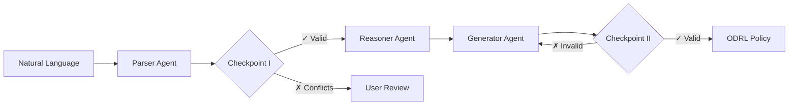
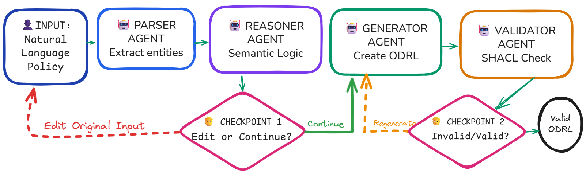

# ODRL Multi-Agent LLM

[](https://www.python.org/)
[](https://fastapi.tiangolo.com/)
[](https://www.langchain.com/)
[](https://langchain-ai.github.io/langgraph/)
[](https://reactjs.org/)
[](https://opensource.org/licenses/MIT)
[](https://doi.org/10.5281/zenodo.17670391)

> **Transform natural language into validated ODRL policies using multi-agent AI**

Automated generation of machine-readable data usage policies through a four-agent pipeline with human-in-the-loop validation.

##  Key Features

- **4-Stage Pipeline**: Parser → Reasoner → Generator → Validator
- **Dual Checkpoints**: Semantic conflict detection + SHACL validation
- **Iterative Refinement**: Auto-corrects validation errors (not single-shot)
- **Multi-Model Support**: Groq, Ollama, OpenAI-compatible endpoints
- **Interactive UI**: Real-time monitoring, manual/auto execution modes

## Quick Start

### Prerequisites
- Python 3.11+
- `uv` installed ([Astral uv](https://docs.astral.sh/uv/))
- Node.js 20+
- At least one LLM provider key (for example Openai)

### 1) Clone and enter project
```bash
git clone https://github.com/Daham-Mustaf/odrl-multi-agent-llm.git
cd odrl-multi-agent-llm
```

### 2) Configure backend
```bash
cd backend
cp .env.example .env
```

Edit `backend/.env` (example):
```env
ENABLE_GROQ=true
GROQ_API_KEY=your_key_here
DEFAULT_MODEL=groq:llama-3.3-70b-versatile
```

Then install dependencies:
```bash
uv sync
```

### 3) Configure frontend
```bash
cd ../frontend
cp .env.example .env
```

Edit `frontend/.env`:
```env
REACT_APP_API_URL=http://localhost:8000
DISABLE_ESLINT_PLUGIN=true
```

Then install dependencies:
```bash
npm install
```

### 4) Run with two terminals
Terminal 1 (backend):
```bash
cd backend
uv run uvicorn main:app --reload --host 0.0.0.0 --port 8000
```

Terminal 2 (frontend):
```bash
cd frontend
HOST=0.0.0.0 PORT=3000 npm start
```

Open: `http://localhost:3000`

### 5) Quick verification
Backend health check:
```bash
curl http://localhost:8000/health
```

**Production deployment:** [Deployment Guide](docs/DEPLOYMENT.md)

## Architecture

```mermaid
graph LR
    A[Natural Language] --> B[Parser Agent]
    B --> C{Checkpoint I}
    C -->|✓ Valid| D[Reasoner Agent]
    C -->|✗ Conflicts| E[User Review]
    D --> F[Generator Agent]
    F --> G{Checkpoint II}
    G -->|✓ Valid| H[ODRL Policy]
    G -->|✗ Invalid| F
```


### Workflow Diagram

*Figure: Multi-agent pipeline with dual human checkpoints. Reasoner (Checkpoint I) enables pre-generation review; Validator (Checkpoint II) enables post-generation refinement. Red dashed: edit input; orange dashed: regenerate; green: continue. Supports per-agent LLM configuration.*

## Documentation

| Guide | Description |
|-------|-------------|
| [ Deployment](docs/DEPLOYMENT.md) | Ubuntu production setup |
| [Configuration](docs/CONFIGURATION.md) | Environment & settings |
| [Development](docs/DEVELOPMENT.md) | Local setup & structure |
| [Testing](docs/TESTING.md) | Test procedures |
| [API Reference](docs/API.md) | Backend endpoints |

## 🎬 Demo

**Video Demo:** https://youtu.be/bpEZx8cqiRQ  

**Screenshot Demos:** Check the full demos [here](docs/index.md).

### ACL Demo Package (Installable)

This repository serves as the **installable package** for ACL demo evaluation.

- Source code: [github.com/Daham-Mustaf/odrl-multi-agent-llm](https://github.com/Daham-Mustaf/odrl-multi-agent-llm)
- Stable version: use the tagged release for your submission (recommended) or a fixed commit hash
- Installation and run instructions: see `Quick Start` and [docs/DEPLOYMENT.md](docs/DEPLOYMENT.md)

If a public live demo endpoint is not available, reviewers can reproduce the system locally from this package using the steps above.


## Tech Stack

**Backend:** FastAPI • LangChain • LangGraph • RDFLib • PySHACL  
**Frontend:** React • Tailwind CSS  
**LLMs:** Groq • Ollama • OpenAI-compatible • Google GenAI


## Authors


- **Daham M. Mustafa** - Fraunhofer FIT, Sankt Augustin, Germany
- **Yixin Peng** - RWTH Aachen University, Germany
- **Diego Collarana** - Fraunhofer FIT, Sankt Augustin, Germany
- **Christoph Lange** - Fraunhofer FIT & RWTH Aachen University, Germany
- **Christoph Quix** - Fraunhofer FIT & RWTH Aachen University, Germany
- **Stefan Decker** - Fraunhofer FIT & RWTH Aachen University, Germany

## Citation

If you use this software in your research, please cite:

**BibTeX:**
```bibtex
@software{mustafa_2025_odrl,
  author       = {Mustafa, Daham M. and
                  Yixin, Peng and
                  Collarana, Diego and
                  Lange, Christoph and
                  Quix, Christoph and
                  Decker, Stefan},
  title        = {ODRL Multi-Agent LLM: A Multi-Agent System for 
                  ODRL Policy Generation},
  year         = 2025,
  publisher    = {Zenodo},
  version      = {v2.1.0},
  doi          = {10.5281/zenodo.17670391},
  url          = {https://doi.org/10.5281/zenodo.17670391}
}
```

## Contributing

Contributions welcome! See [CONTRIBUTING.md](docs/CONTRIBUTING.md)

## License

MIT License - see [LICENSE](LICENSE)

## 🔗 Links

- **Repository:** [github.com/Daham-Mustaf/odrl-multi-agent-llm](https://github.com/Daham-Mustaf/odrl-multi-agent-llm)
- **Issues:** [Report a bug](https://github.com/Daham-Mustaf/odrl-multi-agent-llm/issues)
- **ODRL Spec:** [w3.org/TR/odrl-model](https://www.w3.org/TR/odrl-model/)

