# ODRL Multi-Agent LLM

[](https://www.python.org/)
[](https://fastapi.tiangolo.com/)
[](https://www.langchain.com/)
[](https://langchain-ai.github.io/langgraph/)
[](https://reactjs.org/)
[](https://opensource.org/licenses/MIT)
[](https://doi.org/10.5281/zenodo.17670391)

> **Transform natural language into validated ODRL policies using multi-agent AI**

Automated generation of machine-readable data usage policies through a four-agent pipeline with human-in-the-loop validation.

##  Key Features

- **4-Stage Pipeline**: Parser → Reasoner → Generator → Validator
- **Dual Checkpoints**: Semantic conflict detection + SHACL validation
- **Iterative Refinement**: Auto-corrects validation errors (not single-shot)
- **Multi-Model Support**: Groq, Ollama, OpenAI-compatible endpoints
- **Interactive UI**: Real-time monitoring, manual/auto execution modes

## Quick Start

**Local Development:**
```bash
# Backend
cd backend && uv sync
uv run uvicorn main:app --reload --host 0.0.0.0 --port 8000

# Frontend
cd frontend && npm install && npm start
```

**Production:** [📖 Deployment Guide →](docs/DEPLOYMENT.md)

## Architecture

```mermaid
graph LR
    A[Natural Language] --> B[Parser Agent]
    B --> C{Checkpoint I}
    C -->|✓ Valid| D[Reasoner Agent]
    C -->|✗ Conflicts| E[User Review]
    D --> F[Generator Agent]
    F --> G{Checkpoint II}
    G -->|✓ Valid| H[ODRL Policy]
    G -->|✗ Invalid| F
```


## Documentation

| Guide | Description |
|-------|-------------|
| [ Deployment](docs/DEPLOYMENT.md) | Ubuntu production setup |
| [Configuration](docs/CONFIGURATION.md) | Environment & settings |
| [Development](docs/DEVELOPMENT.md) | Local setup & structure |
| [Testing](docs/TESTING.md) | Test procedures |
| [API Reference](docs/API.md) | Backend endpoints |

## 🎬 Demo

**Video Demo:** [Watch on YouTube](https://youtube.com/demo)  
**Live Demo:** [Try it here](https://demo.example.com)  
**Source Code:** [GitHub Repository](https://github.com/Daham-Mustaf/odrl-multi-agent-llm)

## Tech Stack

**Backend:** FastAPI • LangChain • LangGraph • RDFLib • PySHACL  
**Frontend:** React • Tailwind CSS  
**LLMs:** Groq • Ollama • OpenAI-compatible • Google GenAI

## Research Context

Developed at **Fraunhofer FIT** & **RWTH Aachen University** for:
- NFDI4Culture
- Daten-Raum-Kultur (DRK)
- Cultural Heritage Dataspaces


## Authors


- **Daham M. Mustafa** - Fraunhofer FIT, Sankt Augustin, Germany
- **Diego Collarana** - Fraunhofer FIT, Sankt Augustin, Germany
- **Christoph Lange** - Fraunhofer FIT & RWTH Aachen University, Germany
- **Christoph Quix** - Fraunhofer FIT & RWTH Aachen University, Germany
- **Stefan Decker** - Fraunhofer FIT & RWTH Aachen University, Germany

## Citation

If you use this software in your research, please cite:

**BibTeX:**
```bibtex
@software{mustafa_2025_odrl,
  author       = {Mustafa, Daham M. and
                  Collarana, Diego and
                  Lange, Christoph and
                  Quix, Christoph and
                  Decker, Stefan},
  title        = {ODRL Multi-Agent LLM: A Multi-Agent System for 
                  ODRL Policy Generation},
  year         = 2025,
  publisher    = {Zenodo},
  version      = {v2.1.0},
  doi          = {10.5281/zenodo.17670391},
  url          = {https://doi.org/10.5281/zenodo.17670391}
}
```

## Contributing

Contributions welcome! See [CONTRIBUTING.md](docs/CONTRIBUTING.md)

## License

MIT License - see [LICENSE](LICENSE)

## 🔗 Links

- **Repository:** [github.com/Daham-Mustaf/odrl-multi-agent-llm](https://github.com/Daham-Mustaf/odrl-multi-agent-llm)
- **Issues:** [Report a bug](https://github.com/Daham-Mustaf/odrl-multi-agent-llm/issues)
- **ODRL Spec:** [w3.org/TR/odrl-model](https://www.w3.org/TR/odrl-model/)

